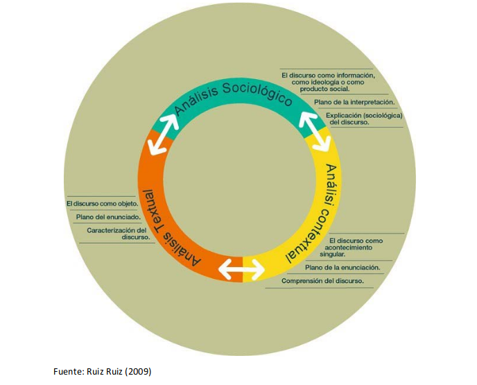
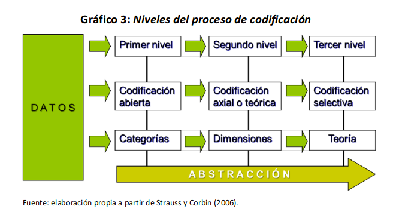
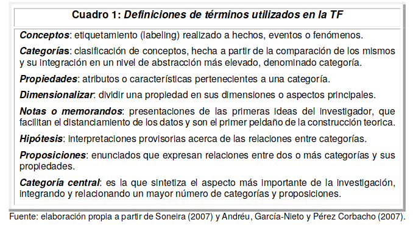

# Del diálogo a la teoría. El proceso de análisis de entrevistas
## Pablo Francisco Di Leo

Toda investigación social deberá partir de un distanciamiento  crítico  de  las  realidades  socialmente  construidas  para  iniciar  luego  la  construcción de su objeto. 

Utilizando  las  herramientas  que  nuestro propio campo nos proporciona, los cientistas sociales debemos explicitar las relaciones de poder, simbólicas, e institucionales que fueron configurando históricamente el lenguaje, los problemas  y  metodologías  que  utilizamos  en nuestros procesos  de  investigación. 

##  La construcción del objeto

Toda práctica científica implica supuestos teóricos. Durante todo el proceso de investigación, es necesario mantener, una vigilancia epistemológica, una reflexión sobre la validez de los propios instrumentos utilizados, que depende en cada caso de su adecuación al objeto.

El  trabajo  de  abstracción  es  el  único  capaz  de  romper  con  las  semejanzas  aparentes (en las que caen la sociología espontánea o la ideología) para construir las analogías ocultas.  La  analogía  no  se  establece  entre  “cosas”  que  se  ofrecerían  a  la  percepción  ingenua  sino entre objetos conquistados contra las apariencias inmediatas y construidos mediante una elaboración metódica.

## Los discursos como objetos sociológicos

En la investigación social cualitativa –sobre todo si el instrumento elegido son las entrevistas– nuestro objeto principal es el discurso, que podemosdefinir sintéticamente como toda práctica mediante la cual los sujetos asignan un sentido a la realidad (Ruiz Ruiz, 2009). 

Las prácticas discursivas  son  objetos  privilegiados  de  las  ciencias  sociales  porque  toda  acción  social  se  orienta  por  los  sentidos  que  le  dan  los  sujetos  al  mundo  (Schutz,  1995; Weber,  1997).  Sin  embargo, stos procesos de significación nos son individuales.

Michel  Foucault  (1992)  habla  de  prácticas  discursivas  como  relaciones sociales, relaciones  de  poder-resistencia,  aunque  también  nos  recuerda  que  no  siempre  se  percibe su carácter político e histórico-social.

Ernesto Laclau y Chantal Mouffe (1987) proponen superar los elementos substancialistas  del  marxismo  y  el  estructuralismo  recuperando  y  redefiniendo  la  categoría  gramsciana de hegemonía. 

La hegemonía debe entenderse como múltiples y conflictivas prácticas discursivas articulatorias que no irradian de un único centro de poder, sino que son a la vez el producto y condición de las múltiples instituciones y actores que atraviesan, tratando de definir(se), al cuerpo social. A su  vez,  para  imponer  su  representación  de  la  totalidad  social,  las  prácticas  discursivas  hegemónicas buscan establecer puntos nodales, significantes flotantes, alrededor de los cuales fijar lo social como un sistema organizado de diferencias.

Síntesis: los  discursos  contienen  de  manera  implícita  las  palabras  ajenas,  los  enunciados  individuales  de  otros,  por  lo  que  la  investigación  social  puede  reconstruir  analíticamente  la estructura y las posiciones de sujetos que conforman dicha intersubjetividad.

El abordaje sociológico de los discursos parte de dos supuestos fundamentales:  

a) La intersubjetividad  es  producto  del  orden  social  y,  simultáneamente,  el  orden  social  se  constituye y funciona intersubjetivamente. Por ende, el estudio de la intersubjetividad nos proporciona un conocimiento privilegiado del orden social.

b) La  intersubjetividad  se  produce  en prácticas  discursivas,  por  lo  que  mediante  el  análisis sociológico del discurso podemos acceder al conocimiento del contenido, la extensión, los límites y la estructura de la intersubjetividad (Ruiz Ruiz, 2009).

## Los niveles del análisis sociológico de los discursos

El  estudio sociológico de las prácticas discursivas requiere tener en cuenta tres niveles articulados, que  no  responden  a  un  orden  o  secuencia  lineal,  sino  que  deben  ser  considerados  de  manera  simultánea durante todo el proceso analítico: el textual, el contextual y el sociológico.

### El análisis textual
El análisis textual considera las prácticas discursivas como objetos. Posee una objetividad sólo aparente, ya que bajo la misma nos encontramos necesariamente los sujetos que realizamos una lectura, dentro de las múltiples posibles: seleccionamos los elementos relevantes y establecemos las relaciones que consideramos significativas según nuestros puntos de vista (Ruiz y Ruiz, 2009).

La primera operación del análisis textual es la traducción, que realizamos mediante dos procedimientos principales: la descripción –aplicada a las prácticas discursivas no verbales–   y la transcripción, aplicada a los discursos  orales.  

Es  importante  que  ambos  procedimientos  sean  lo  más  detallados  posibles,  incluyendo  todos  los  elementos  antecedentes  y  contextuales  que  puedan  contribuir  a  la  interpretación. En  las  transcripciones  es  importante  incluir  todas  las  situaciones  no  verbales (silencios,  modulaciones,  énfasis,  gestos  y  expresiones  significativas)  y  las  descripciones  de  escenarios y prácticas no verbales (rituales, movilidades, movimientos corporales) deben ser lo más detalladas y exhaustivas posibles.

El análisis textual consiste en el despliegue y descomposición de los textos en sus elementos constitutivos, buscando identificar la multiplicidad y articulación entre enunciados, posiciones de  sujetos  y  significaciones  presentes  en  los  discursos.

El **análisis de contenido** consiste básicamente en la descomposición o fragmentación del texto en sus unidades  constitutivas  para  su  posterior  codificación. Previo  a  su  codificación, los investigadores formulan un conjunto de categorías analíticas surgidas de sus marcos teóricos y preguntas de investigación a partir de las cuales establecen cuál es el interés o valor del texto, cómo  se  fragmenta  y,  sobre  todo,  cómo  se  clasifican  y  codifican  los  fragmentos. 

El **análisis  semiótico  o semiología** parte  de  una  concepción  dialéctica  de  la  relación  entre  discursos  y  lenguaje:  los  primeros  utilizan  el  lenguaje  (el  conjunto  de  códigos  y  sentidos compartidos) para expresarse, pero al hacerlo también lo transforman y lo renuevan

El análisis  **semiótico  estructural** se propone  desvelar  los  códigos  lingüísticos  no  evidentes,  tratando de descubrir y describir su lógica interna, entendida ésta como una matriz generativa que “re-produce” el texto. Este enfoque puede ser útil para la investigación social, siempre que no se utilice de manera totalizadora, es decir, siempre que se circunscriba al nivel textual y no se  generen  interpretaciones  abusivas.  El análisis  semiótico  formal  centra  su  atención  en  los  efectos de sentido de los discursos en el plano de la enunciación. Supone, por tanto, una primera consideración de los contextos en el que los mismos son producidos y en los que actúan.

### El análisis contextual

Este  nivel  de  análisis,  complementario  del  anterior,  se  centra  en  el  estudio  del  contexto,  el  espacio en el que las prácticas discursivas surgen y adquieren sentido. 

Se busca comprender las prácticas discursivas como acontecimientos singulares, generadas por sujetos que se encuentran insertos  en  un  espacio  y  un  tiempo  concretos,  en  un  universo  simbólico  determinado  y  con  intenciones propias. 

Desde este punto de vista,  podemos distinguir dos tipos de contextos quedan lugar a dos grandes enfoques analíticos: el situacional y el intertextual(Ruiz y Ruiz, 2009). 

El **análisis situacional** del discurso requiere de la descripción detallada de las circunstancias en que  ha  sido  producido  y  de  las  características  de  los  sujetos  que  lo  producen. Si la entrevista es individual o grupal; si existen relaciones previas entre los sujetos investigados o entre éstos y los  investigadores;  las  condiciones  espaciales  y  temporales  del  encuentro,  entre  otras. 

- El análisis  del  marco o frame  analysis  es  un  procedimiento  de  análisis  situacional muy  útil, proveniente de las propuestas analíticas de Erving Goffman (2006). Según este enfoque, para la comprensión y explicación de la acción social debe atenderse a las normas locales que rigen en  las  interacciones  cotidianas,  en  este  caso,  las  situaciones  concretas  en  las  que  se  han  producido las entrevistas.

- El análisis conversacional se centra en las interacciones comunicativas como un proceso de negociación de los sentidos, tanto de la propia situación  comunicativa  como  de  los  discursos  producidos.

El **análisis intertextual** busca comprender las prácticas discursivas poniéndolas en diálogo con el universo simbólico, cultural y los géneros discursivos presentes  en determinado  espacio  social  y  en  relación  a  los  cuales  adquieren  sentido. Este  tipo  de  abordaje  pregunta a “a cada fragmento de un discurso analizado sobre sus presuposiciones, con qué otro discurso se encuentra dialogando y, por tanto, con qué otro discurso o discursos se encuentra en una relación asociativa o conflictiva” (Alonso y Callejo, 1999: 49).

### El análisis sociológico

Este  enfoque  busca  establecer  conexiones  entre  las  prácticas  discursivas  estudiadas  y  el  espacio  social  en  el  que  se  insertan.  Estas  vinculaciones  pueden  ser  muy  diversas,  en  función  de  las orientaciones teóricas  adoptadas  por  los  investigadores. 

Enfoques:

*a. Los  que  entienden  a  los  discursos como fuentes información de lo social; *    
Los sujetos, por el mero hecho de ser parte de la realidad social, disponen de un conocimiento sobre la misma y sus discursos contienen este conocimiento. Por ende, el análisis de las prácticas discursivas proporcionaría una información relevante sobre lo social

*b. los que los consideran efectos o expresiones de las ideologías*    
Se interesan en los puntos  de  vista  de  los  sujetos  como indicios  de  construcciones  ideológicas  o  hegemónicas: modos intersubjetivos de percibir el mundo y posicionarse en él, insertos en contextos socio-históricos concretos. Para  estas  corrientes,  las  investigaciones  sociales  pueden aportar  a  la visibilización y  a  la  desnaturalización  de  los  mecanismos  de  dominación, contribuyendo así a su superación.

*c. los que los estudian como productos sociales*
Considera a las prácticas discursivas  como  productos  sociales,  cuyo  análisis  nos  puede  revelar  de  manera  indirecta  aspectos fundamentales de la vida y la estructura social.  Las preguntas  clave de  este enfoque  son:  ¿por  qué  se  han  producido  estos  discursos y  no  otros?; ¿qué condiciones sociales han posibilitado que surjan estos discursos y no otros? 

## La teoría fundamentada (grounded theory): propuestas y herramientas

La teoría  fundamentada  (grounded  theory)  (TF)  es  una  propuesta  metodológica para la producción  y  análisis  sociológico  de  textos,  imágenes  y  otros  datos  cualitativos  –pero quetambién puede aplicarse a los cuantitativos–   dirigida a la generación de teoría a partir de datossistemáticamente  recogidos  y  analizados.  

Esta  propuesta  busca  desarrollar explicaciones  y  conceptos cada vez más abstractos acerca de los discursos, las acciones, las interpretaciones y los  contextos  sociales  de  los  sujetos de  la  investigación,  produciendo datos  específicos  para  completar, refinar y controlar las categorías conceptuales emergentes (Glaser y Strauss, 1967; Strauss y Corbin, 2006; Andréu, García-Nieto y Pérez Corbacho, 2007; Soneira, 2007). 

En síntesis, la TF merece una especial atención como propuesta para el análisis sociológico de las prácticas discursivas porque: 

> (...)  concentra  una  gran  parte  del  saber  sociológico  existente hasta finales del siglo XX; fue elaborada por sociólogos procedentes de dos escuelas diferentes, que supieron trabajar juntos yuxtaponiendo elementos de ambas escuelas en un ejemplo de heterodoxia y libertad sociológica;  ofrece  un  método  de  análisis,  especialmente  para  datos  cualitativos,  que  proporciona indicios para guiar la investigación y estimula al analista a ir más allá del relato o  la  descripción  y  le  alienta  a  formular  proposiciones  teóricas  (Andréu,  García-Nieto  y  Pérez Corbacho, 2007: 48).

Las tres principales herramientas propuestas por la TF son la codificación, el muestreo teórico y la comparación constante.

### La codificación

A  medida  que  vamos construyendo  los  datos  –ya  sea  mediante  entrevistas,  grupos  focales  u  otras técnicas de investigación social–, vamos leyendo y comparando los mismos, tratando de dar  una  denominación  común  a  aquellos  que  comparten  una  misma  significación.  Esta  operación se denomina codificar, e implica leer y releer los datos buscando descubrir relacionespara  iniciar  el  proceso  de  interpretación.

En  esta  fase  de  microanálisis,  los  investigadores  sociales  debemos  realizar  dos  actividades  principales:  a)  concentrarnos  en  lo  que  los  sujetos  dicen y cómo lo dicen, buscando comprender los significados que dan a los sucesos y elaborar proposiciones teóricas iniciales; b) identificar las particularidades de los datos, seleccionando los  más  relevantes,  los  que  tienen  con  una  mayor  potencialidad  explicativa,  buscando  ir  generando  un  mayor  nivel  de  abstracción  (Glaser  y  Strauss,  1967; Strauss  y  Corbin,  2006; Andréu,  García-Nieto  y  Pérez  Corbacho,  2007; Soneira,  2007).

La codificación  abierta consiste  en  etiquetar  los  datos  que  obtuvimos,  para  lo  cual  debemos hacer varias lecturas. Procuramos “hacer hablar” a las palabras, buscamos significados en las mismas, pistas que aporten a la teoría a desarrollar: “los datos se “fracturan” y se “abren” para sacar  a  la  luz  los  pensamientos,  ideas  y  significados  que  contienen,  con  el  fin  de  descubrir,  etiquetar  y  desarrollar  conceptos”  (Andréu,  García-Nieto  y  Pérez  Corbacho,  2007:  48). 

Analizamos los datos de manera minuciosa, línea a línea, palabra a palabra, con el objetivo de identificar categorías de información sobre la problemática que se está investigando.  A partir de  este  primer  análisis  van  surgiendo  nuevos  interrogantes  y  vamos  formulando  respuestas  provisorias que nos permiten elaborar las hipótesis o proposiciones analíticas. De esta manera, dentro de cada categoría, vamos identificando diversas propiedades, o subcategorías, buscando nueva  información  para  dimensionalizarlas  (Soneira,  2007). 

Una vez que identificamos una categoría que consideramos relevante, iniciamos el trabajo decodificación axial o teórica: tomamos como eje a una categoría para identificar sus propiedades, es decir, la variedad de condiciones, acciones/interacciones y consecuencias vinculados a los fenómenos  asociados  a  la  misma.  

Mediante  este  tipo  de  codificación  obtenemos  hipótesis  y  proposiciones   que   facilitan   una   mejor   comprensión   de   los   fenómenos   estudiados, proporcionando un camino para la construcción de la categoría central: aquella que tienen una mayor  presencia  en  los  datos  y  se  conecta  con  un  mayor  número  de  categorías.  

Una  vez  construida   la   categoría   central,   iniciamos   la   codificación   selectiva:   nos   centramos   exclusivamente en los códigos, hipótesis y proposiciones  vinculados a dicha categoría, con el objetivo de terminar de refinar y articularlos en un relato, es decir, formular la teoría (Strauss y Corbin, 2006; Andréu, García-Nieto y Pérez Corbacho, 2007; Soneira, 2007). 

### El muestreo teórico

Mediante el muestreo teórico   los   investigadores   vamos   seleccionando   los   casos   a   estudiar,   construyendo   y   comparando datos para ayudar a refinar y articular categorías, para desarrollar así la teoría.

Por ende se realizan  el trabajo de campo, la codificación, la comparación y  el  análisis  de  los  datos  de  manera  simultánea.

Las  preguntas,  hipótesis  y  proposiciones  surgidas de las primeras etapas de codificación y análisis van especificando los nuevos datos que necesitamos para corroborarlos y orientando nuestros regresos al campo. En este camino nos  vamos  preguntando: ¿qué  grupos  o  subgrupos  de  sujetos,  situaciones,  actividades  o  discursos hay que relevar para desarrollar estas categorías o teorías? (Glaser y Strauss, 1967; Strauss y Corbin, 2006; Andréu, García-Nieto y Pérez Corbacho, 2007; Soneira, 2007).

Este trabajo de construcción y análisis de datos continúa hasta llegar a la **saturación teórica**:

>(...)  momento  en  el  cual  no  surgen  de  los  datos  analizados  nuevas  propiedades  de  la  categoría, es decir, cuando los datos no aportan nada nuevo. Si se codifica un suceso de esa condición  se  aumenta  el  cuerpo  de  datos  codificados  pero  no  se  añade  nada  nuevo  a  la  teoría.  El  muestreo  teórico  y  la  saturación  teórica  tienen  la  característica  de  que  proporcionan  una  guía  para  recoger  sólo  los  datos  que  son  necesarios  y  no  perderse  en  recopilar una gran cantidad de ellos (Andréu, García-Nieto y Pérez Corbacho, 2007: 62)

### La comparación constante

Todo  proceso  de  construcción  de  datos,  codificación,  análisis  y  redacción  de  la  teoría  se  basa  en  la  estrategia  de  la  comparación  constante:  durante  la  codificación comparamos  las  entrevistas  (u  otros  discursos)  entre  sí  para  ir  identificando  las  categorías;  una  vez  identificadas,  las  comparamos  estas  entre  sí  y  con  nuevos  datos  y  otras  teorías  para  identificar  sus  dimensiones  y  propiedades, hasta  terminar  de  formular  la  teoría  emergente (Glaser y Strauss, 1967).

La comparación constante nos permite ir redactando y delimitando la teoría, a partir de dos criterios analíticos fundamentales:  

- parsimonia  (o  economía  científica):  maximizar  la  explicación  y  comprensión  de  un  fenómeno con el mínimo posible de hipótesis, proposiciones y conceptos teórico;
- alcance:  ampliar  el  campo  de  aplicación  de  la  teoría  sin  desligarse  de  su  base  empírica (Soneira, 2007).

Según la TF, no podemos delimitar la literatura significativa para nuestro estudio hasta que no hayamos avanzando en los trabajos de codificación  y  análisis.  Una  vez  identificadas  las  principales  categorías,  sus dimensiones  y  propiedades podemos evaluar qué literatura –tanto producciones de autores consagrados en el campo  como  publicaciones  con resultados  de  otras  investigaciones–    puede  servirnos  para  avanzar  en  nuestra  investigación.

A su vez, las  definiciones  conceptuales  y  los  datos  secundarios que van conformando nuestro estado del arte no tienen un lugar destacadoa priori, sino que le damos la misma importancia que a otras fuentes de datos: a medida que los vamos recopilando y consultando los comparamos con las categorías, hipótesis, proposiciones y teoría emergente,  del  mismo  modo  que  lo  hacemos  con  los  nuevos  datos  y  categorías  que  vamos construyendo durante nuestro proceso de análisis (Dick, 2005; Soneira, 2007).
